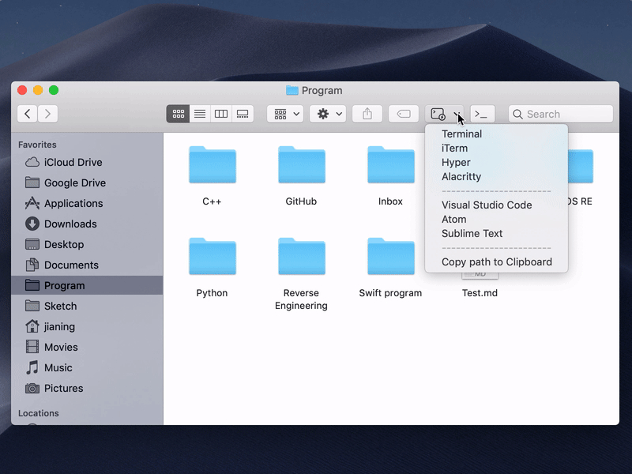
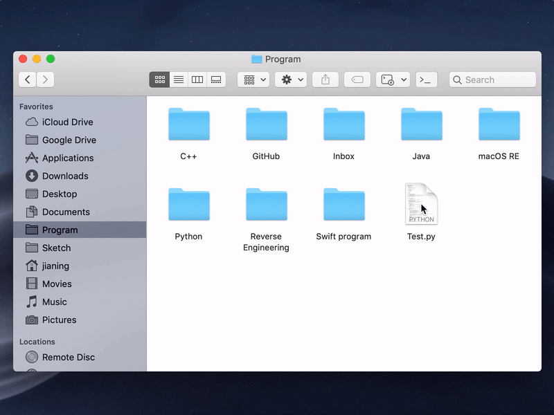
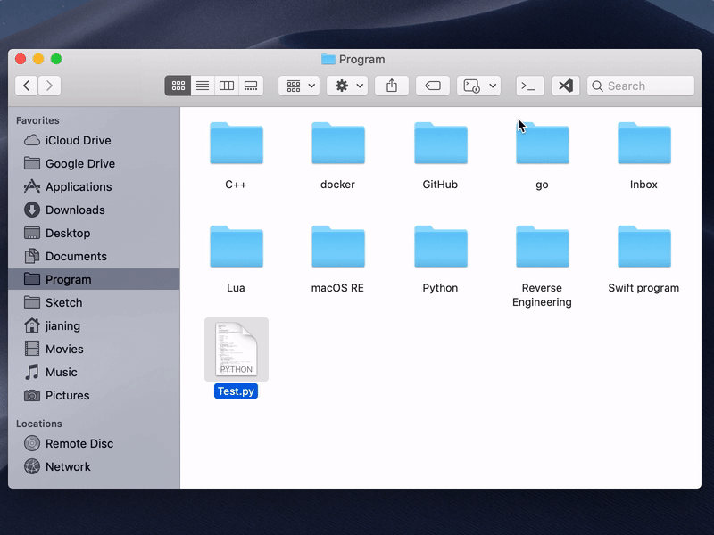
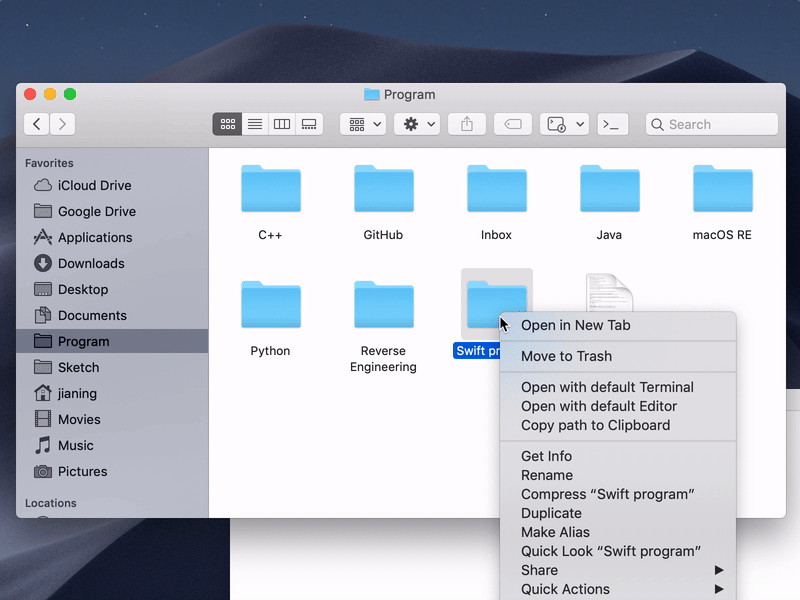

<p align="center">
  <br/><br/>
  <a href="https://github.com/Ji4n1ng/OpenInTerminal/releases/tag/2.1.1"></a>
  <a href="https://github.com/Ji4n1ng/OpenInTerminal/blob/master/LICENSE"></a>
  
  <a href="https://travis-ci.org/Ji4n1ng/OpenInTerminal"></a>
</p>

[English](../README.md) | 中文说明

[OpenInTerminal-Lite English](./README-Lite.md) | [OpenInTerminal-Lite 中文说明](./README-Lite-zh.md)

## 如何使用 🚀

| 功能 | OpenInTerminal | OpenInTerminal-Lite & OpenInEditor-Lite |
| --- | --- | --- |
| 在终端（或编辑器）中打开当前目录 |  |  |
| 在终端（或编辑器）中打开选择的文件夹或文件 |  |  |
| 将已选择的文件或者访达窗口的路径拷贝到粘贴板 |  |  ❌ Not Supported |

### 更多功能

| 功能 | OpenInTerminal | OpenInTerminal-Lite & OpenInEditor-Lite |
| --- | --- | --- |
| 支持 Terminal, [iTerm](https://www.iterm2.com/), [Hyper](https://github.com/zeit/hyper) 和 [Alacritty](https://github.com/jwilm/alacritty). | ✅ | ✅ |
| 支持 [Visual Studio Code](https://code.visualstudio.com/), [VSCode Insiders](https://code.visualstudio.com/insiders/), [Atom](https://atom.io/), [Sublime Text](https://www.sublimetext.com/), [VSCodium](https://github.com/VSCodium/vscodium), [BBEdit](https://www.barebones.com/products/bbedit/)，[TextMate](https://macromates.com)，[CotEditor](https://coteditor.com/) 和 [MacVim](https://github.com/macvim-dev/macvim)。 | ✅ | ✅ |
| 设置为打开新的窗口或者标签页 | ✅ | ✅ |
| 支持中文，英语和法语 | ✅ | ✅ |
| 图形化设置界面 | ✅ | ❌ |
| 支持键盘快捷键 | ✅ | ❌ |
| 支持 Dark Mode | ✅ | ❌ |
| 不需要后台运行 | ❌ | ✅ |

## OpenInTerminal 和 OpenInTerminal-Lite (OpenInEditor-Lite) 👀

选择哪个？这两个应用都是我的孩子。如果你喜欢更强大的功能和图形化设置界面，那么你可以选择 `OpenInTerminal`。如果你仅仅需要更快速且更稳定地打开终端或编辑器，那么你可以选择 `OpenInTerminal-Lite`。

对于我而言，我更喜欢 `OpenInTerminal-Lite`，它只需要点击一次来完成功能（另一个需要点击两次😂），而且它更轻量一些。

对于 `OpenInTerminal-Lite` 用户：

请看文档： [English](./README-Lite.md) | [中文说明](./README-Lite-zh.md)

## 如何安装 🖥

### 1. 下载

#### a) Homebrew (当前版本：2.1.1)

```
brew cask install openinterminal
```

#### b) 手动 (最新版本：2.1.1)

1. 从 [release](https://github.com/Ji4n1ng/OpenInTerminal/releases) 中下载。
2. 将应用移动到 `应用程序` 文件夹。

> ⚠️ 当您第一次运行应用程序时，macOS 将要求访问 `访达` 和 `终端`（或 `iTerm`）的权限。请给予应用程序权限。

### 2. 打开 Finder 扩展权限

打开 OpenInTerminal 应用。去 `系统偏好设置` -> `扩展` -> `访达扩展`，打开下图中的权限按钮。

<div>
  
</div>

## 支持 ❤️

你好，我是 Ji4n1ng。我是一名学生，OpenInTerminal 是我空余时间维护的一个开源项目。它是免费且开源的。如果你能支持我购买苹果开发者账号，我将非常感激。一年 99 美元的花费对于学生来说，并不是一个小的数字，它几乎是我三个星期的生活费。非常感谢！

| PayPal | 支付宝 | 微信 |
| --- | --- | --- |
| [paypal.me/ji4n1ng](https://www.paypal.me/ji4n1ng) |  |  |

## 常见问题 ❓

<details><summary>1. OpenInTerminal 和 OpenInTerminal-Lite 的区别是什么？</summary><br>
<p>OpenInTerminal 目前有正常版和 Lite 版。如果你仅仅需要打开终端而且不需要应用一直常驻后台，那么你可以选择 Lite 版。如果你喜欢更强大的功能，那么你可以选择正常版。</p>
</details>

<details><summary>2. 我不小心点了不授权的按钮</summary><br>
<p>你可以运行以下命令。这会重置系统设置里的权限。</p>
<pre><code>tccutil reset AppleEvents</code></pre>
</details>

<details><summary>3. 路径里的特殊字符</summary><br>
<p>请不要在路径中使用反斜线 <code>\</code> 和双引号 <code>"</code>。</p>
</details>

<details><summary>4. 在 Mojave 上打开了两个终端窗口</summary><br>
<p>这个问题只发生在第一次启动终端的时候。所以，你可以通过 <code>⌘W</code> 来关闭终端的窗口，而不是用 <code>⌘Q</code> 来退出终端。</p>
</details>

<details><summary>5. 访达扩展独立运行模式</summary><br>
<p>访达扩展目前完全依赖于 AppleScript 以便于能够独立运行。所以很难保证它的稳定性。当你发现访达扩展不能正常工作的时候，你需要按住 <code>Option(⌥)</code> 键，右键点击访达并选择 <code>重启</code>。</p>
</details>

<details><summary>6. OpenInTerminal 并不按照我的预期来工作</summary><br>
<p>OpenInTerminal 将会按照以下顺序来打开终端或编辑器：</p>
<ul>
<li>1. 打开你所选中的文件或文件夹。</li>
<li>2. 打开最上面的访达窗口。</li>
<li>3. 都不是。那么打开桌面。</li>
</ul>
<p>例如，当你在下面的访达窗口中选中了一个文件而你想打开最上面的访达窗口到终端中，按照上面的顺序，这将不会按照你所预期的来工作。</p>
<p>问：我右键点击了桌面，但是没有打开终端或者编辑器。但是状态栏菜单里的功能却能正常运行。</p>
<p>答：选中一个文件（文件夹）或者打开一个访达窗口。因为当你右键点击桌面的时候，没有任何东西是被选中的状态，所以系统并不能把选中文件的路径提供给程序使用。在这种情况下，程序将不能正常工作。<br>目前访达扩展和状态栏菜单中的功能并不是同一种方式来实现的。访达扩展为了能够独立运行，现在完全基于 AppleScript。然而状态栏菜单中的功能的实现方式还和以前一样。所以它们会有不同的表现行为。这个问题会在未来得到改进。</p>
</details>

## 特别感谢 ❤️

### 贡献者

- [Camji55](https://github.com/Camji55)

### 译者

- [Dorian Eydoux](https://github.com/dorianeydx)

### 参考项目

- [jbtule/cdto](https://github.com/jbtule/cdto)
- [es-kumagai/OpenTerminal](https://github.com/es-kumagai/OpenTerminal)
- [tingraldi/SwiftScripting](https://github.com/tingraldi/SwiftScripting)